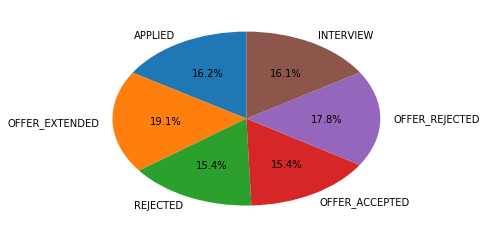
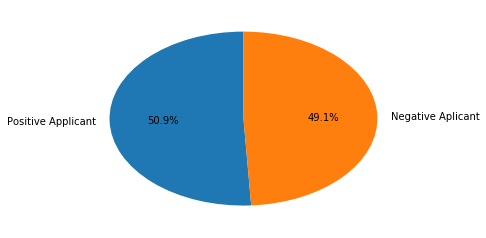

```python
from collections import Counter

import pandas as pd

applications = pd.read_json("../../data/applications.json")
people = pd.read_json("../../data/people.json")
jobs = pd.read_json("../../data/jobs.json")

master = people.merge(right=applications, how='inner', left_on='id', right_on='personId').merge(right=jobs, how='inner',
                                                                                                left_on='jobId',
                                                                                                right_on='id')
cities = pd.DataFrame(columns=['cities'], data=map(lambda x: x['city'], map(dict, master['address'])))

visual = master[['title', 'status']].join(cities)
visual
```


```python
from matplotlib.pyplot import pie

status = Counter(visual['status'])
status = pd.DataFrame(data=status.values(), index=status.keys())
status

plot = pie(status[0], labels=status.index, autopct='%1.1f%%', startangle=90)
```





```python
print type(visual.groupby(['title', 'cities']).agg({'cities': 'count'}))

```


<div>
<style scoped>
    .dataframe tbody tr th:only-of-type {
        vertical-align: middle;
    }

    .dataframe tbody tr th {
        vertical-align: top;
    }

    .dataframe thead th {
        text-align: right;
    }
</style>
<table border="1" class="dataframe">
  <thead>
    <tr style="text-align: right;">
      <th></th>
      <th></th>
      <th>cities</th>
    </tr>
    <tr>
      <th>title</th>
      <th>cities</th>
      <th></th>
    </tr>
  </thead>
  <tbody>
    <tr>
      <th rowspan="10" valign="top">Account Executive</th>
      <th>Baborow</th>
      <td>2</td>
    </tr>
    <tr>
      <th>Harrisburg</th>
      <td>2</td>
    </tr>
    <tr>
      <th>Huating</th>
      <td>1</td>
    </tr>
    <tr>
      <th>Izumi</th>
      <td>1</td>
    </tr>
    <tr>
      <th>La Concepcion</th>
      <td>1</td>
    </tr>
    <tr>
      <th>Ocucaje</th>
      <td>2</td>
    </tr>
    <tr>
      <th>San Antonio de Los Altos</th>
      <td>2</td>
    </tr>
    <tr>
      <th>San Francisco</th>
      <td>1</td>
    </tr>
    <tr>
      <th>Walakeri</th>
      <td>3</td>
    </tr>
    <tr>
      <th>Zamboanga</th>
      <td>1</td>
    </tr>
    <tr>
      <th rowspan="19" valign="top">Adjunct Professor</th>
      <th>Artemivsk</th>
      <td>4</td>
    </tr>
    <tr>
      <th>Baborow</th>
      <td>4</td>
    </tr>
    <tr>
      <th>Chengji</th>
      <td>2</td>
    </tr>
    <tr>
      <th>Dvorichna</th>
      <td>2</td>
    </tr>
    <tr>
      <th>El Carmen de Bolivar</th>
      <td>6</td>
    </tr>
    <tr>
      <th>Halamendu</th>
      <td>4</td>
    </tr>
    <tr>
      <th>Harrisburg</th>
      <td>3</td>
    </tr>
    <tr>
      <th>Huating</th>
      <td>5</td>
    </tr>
    <tr>
      <th>Izumi</th>
      <td>2</td>
    </tr>
    <tr>
      <th>Juexi</th>
      <td>4</td>
    </tr>
    <tr>
      <th>La Concepcion</th>
      <td>6</td>
    </tr>
    <tr>
      <th>Marechal Candido Rondon</th>
      <td>3</td>
    </tr>
    <tr>
      <th>Ocucaje</th>
      <td>1</td>
    </tr>
    <tr>
      <th>Piran</th>
      <td>3</td>
    </tr>
    <tr>
      <th>Raydah</th>
      <td>2</td>
    </tr>
    <tr>
      <th>San Francisco</th>
      <td>2</td>
    </tr>
    <tr>
      <th>Sec</th>
      <td>6</td>
    </tr>
    <tr>
      <th>Walakeri</th>
      <td>3</td>
    </tr>
    <tr>
      <th>Zamboanga</th>
      <td>3</td>
    </tr>
    <tr>
      <th>Ballistic Test Article</th>
      <th>Baborow</th>
      <td>1</td>
    </tr>
    <tr>
      <th>...</th>
      <th>...</th>
      <td>...</td>
    </tr>
    <tr>
      <th rowspan="12" valign="top">Test Pilot</th>
      <th>Izumi</th>
      <td>7</td>
    </tr>
    <tr>
      <th>Juexi</th>
      <td>6</td>
    </tr>
    <tr>
      <th>La Concepcion</th>
      <td>9</td>
    </tr>
    <tr>
      <th>Marechal Candido Rondon</th>
      <td>14</td>
    </tr>
    <tr>
      <th>Ocucaje</th>
      <td>10</td>
    </tr>
    <tr>
      <th>Piran</th>
      <td>7</td>
    </tr>
    <tr>
      <th>Raydah</th>
      <td>8</td>
    </tr>
    <tr>
      <th>San Antonio de Los Altos</th>
      <td>8</td>
    </tr>
    <tr>
      <th>San Francisco</th>
      <td>9</td>
    </tr>
    <tr>
      <th>Sec</th>
      <td>16</td>
    </tr>
    <tr>
      <th>Walakeri</th>
      <td>8</td>
    </tr>
    <tr>
      <th>Zamboanga</th>
      <td>6</td>
    </tr>
    <tr>
      <th rowspan="18" valign="top">Vice President</th>
      <th>Artemivsk</th>
      <td>1</td>
    </tr>
    <tr>
      <th>Chengji</th>
      <td>3</td>
    </tr>
    <tr>
      <th>Dvorichna</th>
      <td>2</td>
    </tr>
    <tr>
      <th>El Carmen de Bolivar</th>
      <td>2</td>
    </tr>
    <tr>
      <th>Halamendu</th>
      <td>1</td>
    </tr>
    <tr>
      <th>Harrisburg</th>
      <td>2</td>
    </tr>
    <tr>
      <th>Huating</th>
      <td>2</td>
    </tr>
    <tr>
      <th>Izumi</th>
      <td>2</td>
    </tr>
    <tr>
      <th>Juexi</th>
      <td>1</td>
    </tr>
    <tr>
      <th>La Concepcion</th>
      <td>1</td>
    </tr>
    <tr>
      <th>Marechal Candido Rondon</th>
      <td>2</td>
    </tr>
    <tr>
      <th>Ocucaje</th>
      <td>5</td>
    </tr>
    <tr>
      <th>Piran</th>
      <td>1</td>
    </tr>
    <tr>
      <th>San Antonio de Los Altos</th>
      <td>1</td>
    </tr>
    <tr>
      <th>San Francisco</th>
      <td>6</td>
    </tr>
    <tr>
      <th>Sec</th>
      <td>1</td>
    </tr>
    <tr>
      <th>Walakeri</th>
      <td>1</td>
    </tr>
    <tr>
      <th>Zamboanga</th>
      <td>2</td>
    </tr>
  </tbody>
</table>
<p>535 rows × 1 columns</p>
</div>


```python
positive_applicant = visual.where((visual['status'] == 'OFFER_ACCEPTED') | (visual['status'] == 'OFFER_EXTENDED')).agg(
    {'status': 'count'})
positive_applicant

negative_applicant = visual.where((visual['status'] == 'OFFER_REJECTED') | (visual['status'] == 'REJECTED')).agg(
    {'status': 'count'})
negative_applicant

plot = pie(pd.Series([positive_applicant, negative_applicant]), labels=['Positive Applicant', 'Negative Aplicant'],
           startangle=90, autopct='%1.1f%%', )

```





```python
# Positive Applicants
positive_applicant = visual.where(
    (visual['status'] == 'OFFER_ACCEPTED') | (visual['status'] == 'OFFER_EXTENDED')).groupby('cities').agg(
    {'cities': 'count'})
plot = positive_applicant.plot.bar(title='Positive Applicants vs Cities', figsize=(20, 12))

```


<div>
<style scoped>
    .dataframe tbody tr th:only-of-type {
        vertical-align: middle;
    }

    .dataframe tbody tr th {
        vertical-align: top;
    }

    .dataframe thead th {
        text-align: right;
    }
</style>
<table border="1" class="dataframe">
  <thead>
    <tr style="text-align: right;">
      <th></th>
      <th>cities</th>
    </tr>
    <tr>
      <th>cities</th>
      <th></th>
    </tr>
  </thead>
  <tbody>
    <tr>
      <th>Artemivsk</th>
      <td>34</td>
    </tr>
    <tr>
      <th>Baborow</th>
      <td>28</td>
    </tr>
    <tr>
      <th>Chengji</th>
      <td>43</td>
    </tr>
    <tr>
      <th>Dvorichna</th>
      <td>30</td>
    </tr>
    <tr>
      <th>El Carmen de Bolivar</th>
      <td>36</td>
    </tr>
    <tr>
      <th>Halamendu</th>
      <td>43</td>
    </tr>
    <tr>
      <th>Harrisburg</th>
      <td>28</td>
    </tr>
    <tr>
      <th>Huating</th>
      <td>34</td>
    </tr>
    <tr>
      <th>Izumi</th>
      <td>46</td>
    </tr>
    <tr>
      <th>Juexi</th>
      <td>31</td>
    </tr>
    <tr>
      <th>La Concepcion</th>
      <td>32</td>
    </tr>
    <tr>
      <th>Marechal Candido Rondon</th>
      <td>43</td>
    </tr>
    <tr>
      <th>Ocucaje</th>
      <td>27</td>
    </tr>
    <tr>
      <th>Piran</th>
      <td>37</td>
    </tr>
    <tr>
      <th>Raydah</th>
      <td>31</td>
    </tr>
    <tr>
      <th>San Antonio de Los Altos</th>
      <td>32</td>
    </tr>
    <tr>
      <th>San Francisco</th>
      <td>33</td>
    </tr>
    <tr>
      <th>Sec</th>
      <td>38</td>
    </tr>
    <tr>
      <th>Walakeri</th>
      <td>32</td>
    </tr>
    <tr>
      <th>Zamboanga</th>
      <td>32</td>
    </tr>
  </tbody>
</table>
</div>


```python
# Negative Applicants
negative_applicant = visual.where((visual['status'] == 'OFFER_REJECTED') | (visual['status'] == 'REJECTED')).groupby(
    'cities').agg({'cities': 'count'})
plot = negative_applicant.plot.bar(title='Negative Applicants vs Cities', figsize=(20, 12))
```


<div>
<style scoped>
    .dataframe tbody tr th:only-of-type {
        vertical-align: middle;
    }

    .dataframe tbody tr th {
        vertical-align: top;
    }

    .dataframe thead th {
        text-align: right;
    }
</style>
<table border="1" class="dataframe">
  <thead>
    <tr style="text-align: right;">
      <th></th>
      <th>cities</th>
    </tr>
    <tr>
      <th>cities</th>
      <th></th>
    </tr>
  </thead>
  <tbody>
    <tr>
      <th>Artemivsk</th>
      <td>32</td>
    </tr>
    <tr>
      <th>Baborow</th>
      <td>29</td>
    </tr>
    <tr>
      <th>Chengji</th>
      <td>38</td>
    </tr>
    <tr>
      <th>Dvorichna</th>
      <td>33</td>
    </tr>
    <tr>
      <th>El Carmen de Bolivar</th>
      <td>32</td>
    </tr>
    <tr>
      <th>Halamendu</th>
      <td>23</td>
    </tr>
    <tr>
      <th>Harrisburg</th>
      <td>35</td>
    </tr>
    <tr>
      <th>Huating</th>
      <td>46</td>
    </tr>
    <tr>
      <th>Izumi</th>
      <td>39</td>
    </tr>
    <tr>
      <th>Juexi</th>
      <td>37</td>
    </tr>
    <tr>
      <th>La Concepcion</th>
      <td>34</td>
    </tr>
    <tr>
      <th>Marechal Candido Rondon</th>
      <td>33</td>
    </tr>
    <tr>
      <th>Ocucaje</th>
      <td>32</td>
    </tr>
    <tr>
      <th>Piran</th>
      <td>31</td>
    </tr>
    <tr>
      <th>Raydah</th>
      <td>34</td>
    </tr>
    <tr>
      <th>San Antonio de Los Altos</th>
      <td>36</td>
    </tr>
    <tr>
      <th>San Francisco</th>
      <td>34</td>
    </tr>
    <tr>
      <th>Sec</th>
      <td>30</td>
    </tr>
    <tr>
      <th>Walakeri</th>
      <td>31</td>
    </tr>
    <tr>
      <th>Zamboanga</th>
      <td>26</td>
    </tr>
  </tbody>
</table>
</div>


```python

```
